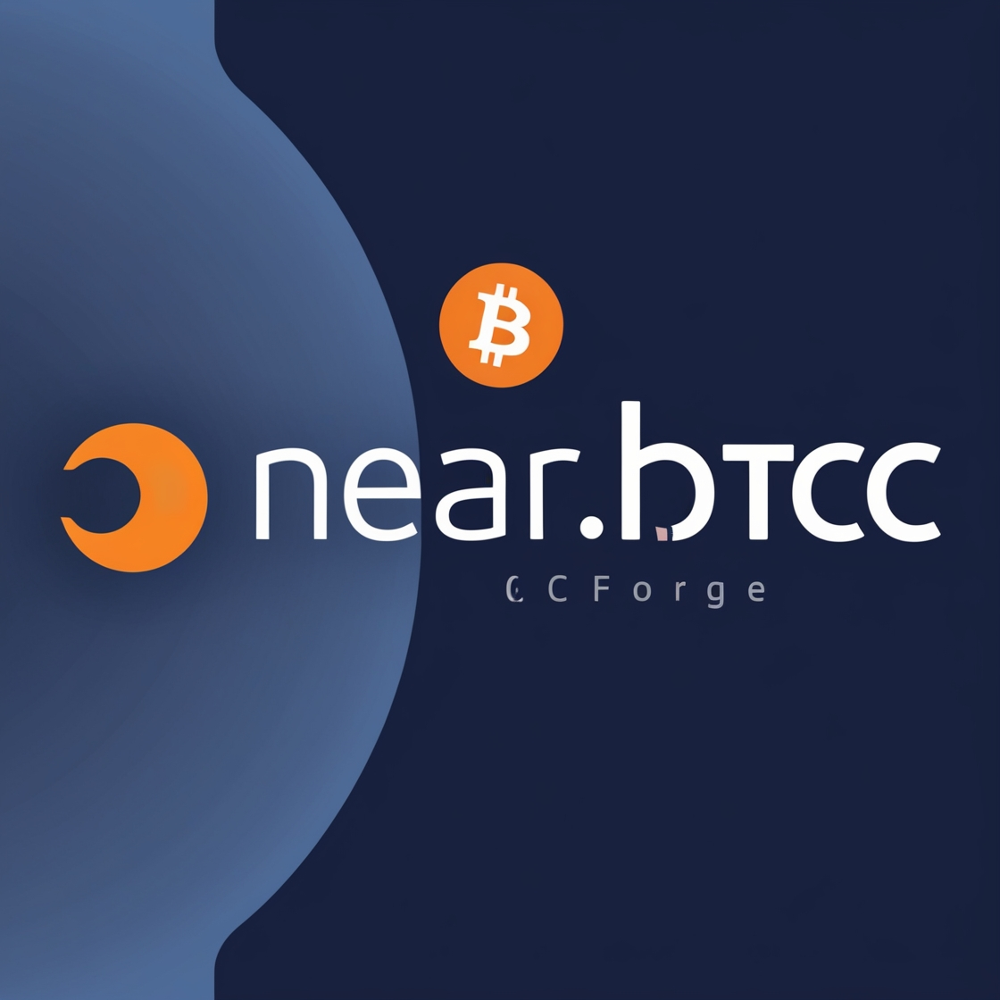

# NearBTCForge



## NearBTCForge is a decentralized application enabling trustless, cross-chain swaps between Ethereum NFTs and Bitcoin Ordinals. Built on NEAR Protocol, NearBTCForge leverages NEAR's scalability, speed, and security, making it easy and cost-effective to bridge assets across chains.

## 🚀 Features
### Cross-Chain NFT & Ordinal Swaps: Exchange assets between Ethereum and Bitcoin without centralized intermediaries.
### Secure Escrow System: Uses NEAR-based escrow contracts to hold assets until the swap is confirmed, ensuring a safe trading experience.
### Multi-Party Computation (MPC): Ensures that cross-chain signatures and transactions remain secure, trustless, and decentralized.
### Easy Wallet Integration: Supports multiple NEAR-compatible wallets for a user-friendly experience.

## 📚 How It Works
### Creating a Swap Order

### Users initiate a swap order, specifying their Ethereum NFT and the desired Bitcoin Ordinal (or vice versa).
### The assets are held in an escrow smart contract on NEAR until the swap is confirmed by both parties.

### Accepting a Swap Order

### Another user can accept the swap order by signing with their NEAR wallet.
###  escrow contract verifies the assets and triggers a cross-chain transaction using NEAR's MPC system.
### Settlement

### Upon successful signatures from both parties, the assets are swapped and released to their new owners.


## Installation Steps
```
git clone https://github.com/your-username/nearbtcforge.git
cd nearbtcforge

yarn 

yarn dev
```